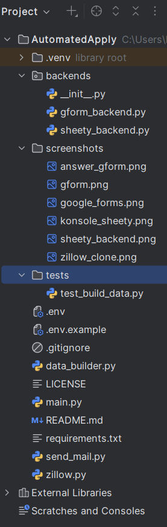
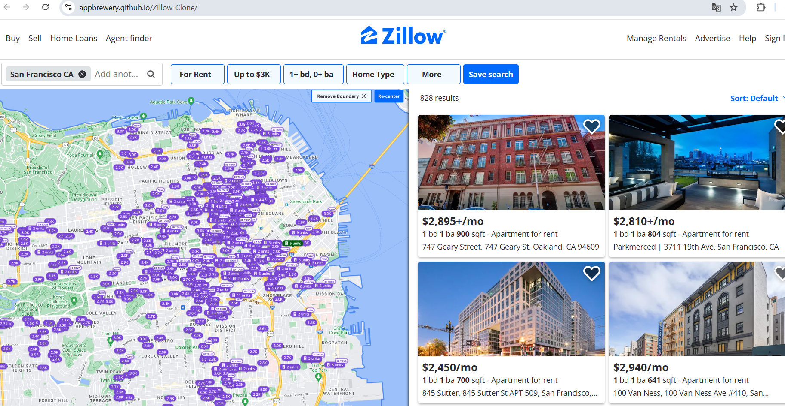
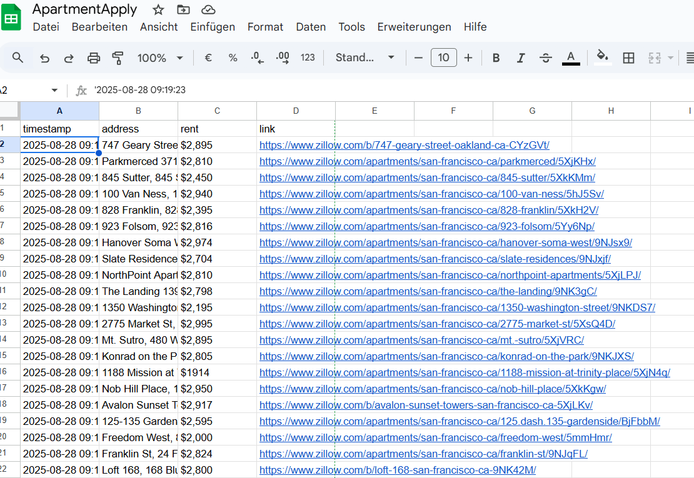
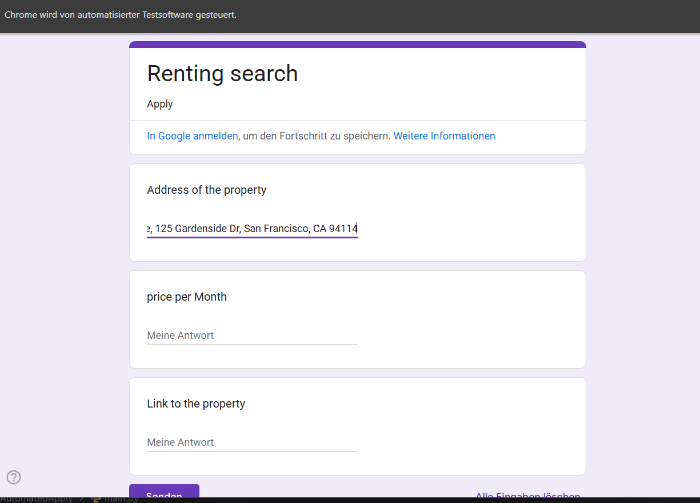
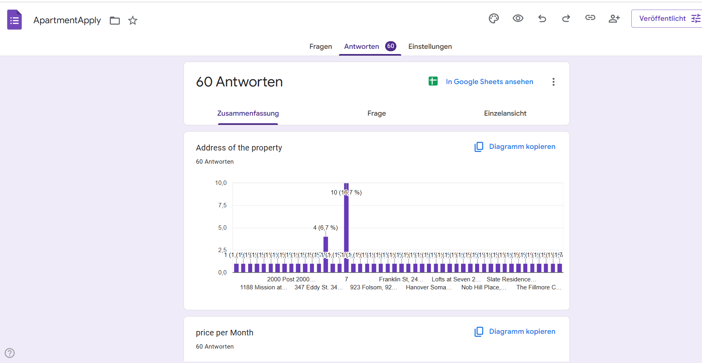

# Auto Apply

## 1. Project Overview

**Auto Apply** is a Python automation tool designed to streamline the rental application process.  
It scrapes rental listings from a Zillow demo site and either automatically fills out a Google Form via Selenium or submits the data to a Sheety-powered Google Sheet.  
After submission, a confirmation email is sent to the user.

⚠️ For legal reasons, this project uses a Zillow Clone and demo Google Form. No real listings or applications are involved.


## 2. Why This Project?

Searching and applying for rentals manually is repetitive, time-consuming, and error-prone.  
This project automates the process, making it ideal for individuals seeking efficiency or developers learning end-to-end automation.

## 3. Features

- Scrape rental listings (address, price, link) from a demo site  
- Transform and format data for form/API input  
- Automatically fill out Google Forms using Selenium  
- Submit data to Sheety API (Google Sheets)  
- Send confirmation email after submission  
- Logging and basic error handling  
- Includes a basic test for data transformation


## 4. Tech Stack

- **Language:** Python 3.11+  
- **Libraries:**  
  - `beautifulsoup4`, `lxml` – HTML parsing  
  - `selenium`, `webdriver-manager` – browser automation  
  - `requests` – API communication  
  - `python-dotenv` – environment variable handling  
  - `smtplib` – email sending


## 5. Installation

```bash
git clone https://github.com/your-username/auto-apply
cd auto-apply
python -m venv .venv
source .venv/bin/activate  # On Windows: .venv\Scripts\activate
pip install -r requirements.txt
cp .env.example .env
```

## 6. Required `.env` variables

```
SHEETY_API_POST=your_sheety_url
SHEETY_TOKEN=your_token
FROM_MAIL=your_email@gmail.com
TO_MAIL=recipient_email@gmail.com
MAIL_PASSWORD=your_email_app_password
```

## 7. Usage

You can run the project in two different modes:

A) Google Form Mode

▶ Simulates a real browser user filling out a form
▶ Best for realistic interaction, visual testing, and showcasing automation with Selenium.

python main.py

B) Sheety Mode (API Submission)

▶ Sends data directly to a Google Sheet via API (Sheety)
▶ Faster and browserless – ideal for headless use or backend-only automation.

```
from zillow import ZillowClone
from data_builder import transform_cards_to_data
from sheety_backend import submit_all

zc = ZillowClone()
soup = zc.get_page()
cards = zc.get_cards(soup)
data = transform_cards_to_data(cards)
submit_all(data)
```

## 8. Project Structure

.
├── main.py                # Entry point for Google Form automation
├── zillow.py              # Scraper for the Zillow demo page
├── data_builder.py        # Transforms scraped data to structured format
├── backends/
│   ├── gform_backend.py   # Google Form auto-submission logic
│   └── sheety_backend.py  # API submission logic
├── send_mail.py           # Sends confirmation email
├── test_build_data.py     # Basic data transformation test
├── requirements.txt
├── .env.example
├── LICENSE
└── README.md

## 9. Clean modular Python code
All scraping, transformation, backend logic and mailing are cleanly separated
across dedicated modules for better readability, testing and reusability.

**Structure**


## 10. Learning Highlights

This project demonstrates:

✔️ End-to-end scraping + automation pipeline  
✔️ Practical use of Selenium with wait strategies  
✔️ Real-world API usage with `requests`  
✔️ Clean modular Python code  
✔️ Environment separation using `.env`  
✔️ Logging & error handling practices  
✔️ Integration of email automation (SMTP)

## 11. Screenshots

**Zillow Clone Site**


**Sheety Mode**


**Gform Mode**


**Answers Gform**


## 12. License

This project is licensed under the [MIT License](./LICENSE) – see the LICENSE file for details.


